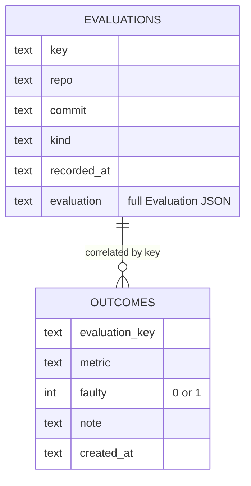

# jev-metrics

[English](./README.md) | [简体中文](./README-zh.md)

> [TypeSafe Jev](https://typesafe.ai/) 评估结果的时间序列持久化 **与** 校准审计。

`jev-metrics` 是 [`jev-review`](https://github.com/NiazMorshed2007/jev-review) 的配套工具：`jev-review` 把每次 Jev 调用变成一个一次性结构化评估，而 **`jev-metrics` 把这些评估随时间持久化，并且更关键的是——审计 Jev 的"置信度"到底可不可信。**

它回答了 `jev-review` 单独回答不了的两个问题：

1. **趋势（Trend）** —— 跨多个 PR 和多次 rescore 之后，19 个质量维度是真在变好，还是分数只是虚浮漂移？
2. **校准（Calibration）** —— Jev 说某个维度"高分且高置信"，它真的对了吗？还是它 **自信地漏掉** 了这次改动后来实际带上线的 bug？

第二个问题才是价值所在：**一个"自信但错了"的评分器，比"老实承认不确定"的更糟** —— 因为它会让 coding agent 和人工 reviewer 都放松警惕。`jev-metrics` 专门把这些 **false-confidence（假阳性置信）** 案例揪出来。

---

## 为什么需要它

Jev 返回的是带 **校准概率** 的定型决策 —— 它声称 90% 置信的决策有约 90% 的概率是对的。但一个维度的 *分数* 不是 Noul；"可读性 = 7.8 @ 0.85 置信"这种说法，几乎没有任何真实改动会拿实际结果去验证。

以下是 `jev-metrics` 能检测到的失效模式：

| 信号 | 含义 |
|--------|---------|
| 置信度 ↑ 但故障率不变 | 置信度只是装饰，没有预测力 |
| 高分 + 高置信 → 事后出问题 | **假阳性置信（False confidence）** —— 最危险、最该先修 |
| 某个维度无论分数高低都主导故障 | 该维度的 rubric/标准用错了杠杆 |
| **分数跨轮次上涨但故障持续** | **Rubric 漂移** —— 评分标准随时间变宽松了 |
| 大部分 outcome 从未记录 | 除了你盯着的几个维度，其他维度全是盲区 |

核心指标：

- **假阳性置信率（False-Confidence rate）** —— 所有 ≥7 分且 ≥0.8 置信的评估里，事后在该维度真实出问题的比例。健康的系统应把它压向 0。
- **期望校准误差（ECE）** —— 报告置信度与观测故障概率之间、按样本量加权的平均差距。越低越好；完美校准是 0。
- **Rubric 漂移** —— 某维度 *平均分跨轮次上涨* 但 *故障率居高不下*（近期 ≥35%）。这是评分 rubric 已变宽松、正在系统性漏检真实缺陷的特征。

---

## 快速上手

需要 Node **≥22.5**（使用内置 `node:sqlite` —— 零运行时依赖）。克隆并构建：

```bash
npm install
npm run build        # 产出 dist/cli.js
```

### 1 · 记录评估

把评估喂给 `record`，自动接受三种形态：

1. **原始 `jev_review` MCP 响应** —— agent 收到的那个 `{ content, structuredContent }` 对象，`Evaluation` 会自动帮你提取出来：

```bash
node dist/cli.js record --db .jev-metrics.sqlite --auto --kind final --file evals/pr-42.json
```

2. **元数据包装（metadata wrapper）**（能自己控制文件时推荐）：

```bash
node dist/cli.js record --db .jev-metrics.sqlite --file evals/pr-42-final.json
```

```json
{
  "metadata": { "key": "pr-42-final", "repo": "acme/api", "commit": "abc789", "kind": "final" },
  "evaluation": {
    "metrics": {
      "correctness": { "applicable": true, "score": 7.8, "confidence": 0.9 },
      "security":   { "applicable": true, "score": 7.9, "confidence": 0.93 }
      /* ...全部 19 个维度... */
    },
    "priorities": []
  }
}
```

3. **裸 `Evaluation`** 加 `--key`。

`--auto` 会从当前 git 仓库推断 `repo` 和 `commit`（`git remote get-url origin` 归一化成 `owner/repo`，加上 `git rev-parse --short HEAD`），并在未指定 `key` 时自动生成 `<repo>@<short-hash>` 这样的稳定 key。显式传入的 `--key` / `--repo` / `--commit` 永远优先于自动推断。

`key` 是 outcome 的关联句柄。重复用同一个 `key` 记录会 **upsert**（所以 baseline 和 rescore 应该用不同的 key 才能保留趋势）。

### 2 · 记录事后 outcome

改动上线 / 到达暂存门禁后，标记真相：

```bash
# 该维度事后没问题：
node dist/cli.js outcome --db .jev-metrics.sqlite --key pr-42-final --metric correctness --note "clean in prod"

# 该维度真实出问题了（即使 Jev 当时很自信）：
node dist/cli.js outcome --db .jev-metrics.sqlite --key pr-42-final --metric security --faulty --note "auth bypass found in prod"
```

`--metric` 是可选的 —— 省略则记录"整次改动"级别的 outcome（用于变更级校准视图）。

### 3 · 生成报告

```bash
node dist/cli.js report --db .jev-metrics.sqlite            # 输出到 stdout
node dist/cli.js report --db .jev-metrics.sqlite --out report.md
```

Markdown 报告包含：**变更时间线（Change timeline）**、**分数趋势矩阵（Score trend）**（`—` 表示该轮不适用）、**回归项（Regressions）**（相邻轮次下滑 ≥0.5），以及 **校准审计（Calibration audit）**（置信度分桶的故障率、**reliability diagram + ECE**、**rubric drift**、假阳性置信列表、每维度覆盖度）。

---

## 校准审计怎么读

```
### Confidence buckets (metric-level samples)
| confidence | samples | faulty | fault rate |
| 0.9–1.0    | 2       | 1      | 50.0%      |

### False-confidence cases (score ≥7 & confidence ≥0.8 that later went faulty)
| metric   | eval key       | score | confidence |
| security | `pr-42-final` | 7.9   | 0.93       |
```

从上往下读：

1. **高置信故障率** —— 这个例子里，2 个高置信样本中有 1 个其实不可信。"假阳性置信率 50%" 的意思是：一半情况下分数说"≥7，我 90% 确定"，结果它是错的。**这个数字没降下来之前，别信这块"护盾"。**
2. **哪个维度？** —— 这里是 `security`，故障率 100%。这正是你最不能承受过度自信的维度。修法是审计该维度的 rubric/标准，而不是调分数。
3. **outcome 覆盖度有多少？** —— 样本 ≤2 的维度会被标记。如果你只给你恰好盯着的两三个维度记 outcome，审计就看不到另外 17 个。这本身就是一条发现。

---

## CLI 参考

```
jev-metrics record   --db <p> [--key k] [--repo r] [--commit c] [--kind k] [--auto] [--file <path>|-]
                     从 --file 或 stdin 读取 Evaluation。接受裸 Evaluation、
                     {metadata, evaluation} 包装，或原始 jev_review
                     {content, structuredContent} 响应。
                     --auto  从 git 推断 repo/commit，未指定时自动生成稳定 key。

jev-metrics outcome  --db <p> --key <evaluation-key> [--metric <name>] [--faulty] [--note t]

jev-metrics report   --db <p> [--out <path>] [--repo <r>]

jev-metrics export   --db <p> [--file <path>]      导出全部记录 + outcome 为 JSON

jev-metrics help
```

可以把 `JEV_METRICS_DB` 设为默认的 `--db`。数据库路径默认为 `.jev-metrics.sqlite`。

---

## GitHub Action

工作流（`.github/workflows/jev-report.yml`）和入口（`scripts/action.mjs`）会从 **已提交的** JSON 文件生成报告 —— 当你希望趋势/校准在 CI 里可见时很有用。

Action 读取：

- `evals/*.json` —— 评估快照（裸 Eval / metadata 包装 / MCP 响应）
- `evals/outcomes/*.json` —— 事后 outcome 标记

并把 Markdown 报告写入 job summary、artifact，以及（通过 `/jev-report` 评论或 merge）关联的 PR/Issue 评论（需要 `pull-requests: write` 权限）。

```bash
# 同样逻辑本地跑，不需要 CI：
JEV_METRICS_EVALS_DIR=evals JEV_METRICS_OUTCOMES_DIR=evals/outcomes \
  node scripts/action.mjs > report.md
```

> 只有在你真正为上线（或到达暂存门禁）的改动记录了 outcome 之后，真实回归才会浮现 —— Action 报告的是你记录的事实，不是魔法。

---

## 数据模型（Schema）

两张表（由 `node:sqlite` 自动创建）：

- **`evaluations`** —— 每个 `key` 一行（upsert）。存储完整 `Evaluation` JSON + `repo / commit / kind / recorded_at` 元数据。
- **`outcomes`** —— 事后真相标记，按 `evaluation_key` 关联，可选限定到某个 `metric`，带 `faulty` 0/1 判定。



---

## 路线图 / 扩展

核心刻意保持精简（三个模块：`store`、`calibration`、`report`）。已实现：

- **每维度 Rubric 漂移检测** ✅ —— 标记"平均分跨轮次上涨但故障率仍高（近期 ≥35%）"的维度，也就是最可能的 rubric 失效点。
- **Reliability diagram + ECE** ✅ —— 真实的置信-故障曲线、单调性检查，以及完整的期望校准误差。
- **Auto-record** ✅ —— `record` 直接接受原始 `jev_review` MCP 响应，`--auto` 从 git 推断 repo/commit/key，让每个 PR 的标注变成一条命令。
- **GitHub Action** ✅ —— `scripts/action.mjs` + 工作流，把报告输出到 job summary、artifact，以及可选的 PR/Issue 评论。

后续想法：

- **Reliability diagram 图表化** —— 把置信-故障曲线渲染成 SVG/PNG（无额外运行时依赖，手写实现）而不是表格。
- **变更级校准** —— 在维度级分桶旁边更突出地展示变更级故障率。

---

## 目录结构（Layout）

```
src/
  types.ts         Evaluation + 持久化信封类型
  store.ts         node:sqlite 持久化（evaluations + outcomes）
  calibration.ts   校准、假阳性置信 & rubric 漂移审计
  report.ts        Markdown 趋势 + 校准报告
  parse.ts         从包装 / MCP 响应形态中提取 Evaluation
  git.ts           --auto 的 best-effort repo/commit 推断
  fromFiles.ts     从已提交的 JSON 文件重建报告（Action 核心）
  cli.ts           record / outcome / report / export 命令
  index.ts         库入口
scripts/
  action.mjs       GitHub Action 入口（写 step summary / stdout）
.github/workflows/
  jev-report.yml   工作流：手动、merge 或 /jev-report 评论触发
test/
  metrics.test.js  单测（store、calibration、report）
  parse.test.js    单测（parse、git 辅助）
  fromFiles.test.js 单测（基于文件的报告重建）
demo/
  *.json           示例评估 + 可运行的 CLI 演示
```

**零运行时依赖** —— dev 依赖只有 `@types/node` 和 `typescript`。构建产物是面向 Node 22+ 的纯 ES modules。

## License

MIT。
