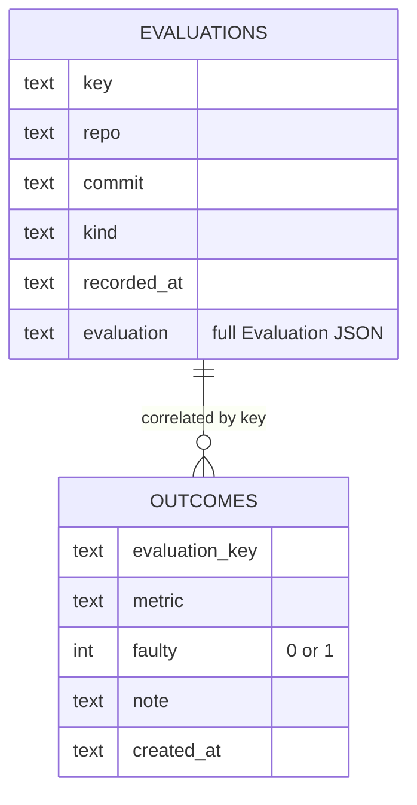

# jev-metrics

> Time-series persistence **and** calibration audit for [TypeSafe Jev](https://typesafe.ai/) evaluation results.

`jev-metrics` complements [`jev-review`](https://github.com/NiazMorshed2007/jev-review): while `jev-review` turns each Jev call into a one-shot structured evaluation, **`jev-metrics` persists those evaluations over time and, crucially, audits whether Jev's confidence is actually trustworthy.**

It answers two questions that `jev-review` alone cannot:

1. **Trend** — Across many PRs and rescore rounds, are the 19 quality dimensions genuinely improving, or are scores just drifting?
2. **Calibration** — Jev says a metric is *high-score at high-confidence*. Was it actually right? Or did it **confidently miss** a bug the change later shipped with?

The second is where most value lives: a scorer that is confident but wrong is worse than one that is honestly uncertain, because it lets both the coding agent and a human reviewer relax. `jev-metrics` surfaces exactly those **false-confidence** cases.

---

## Why this exists

Jev returns typed decisions with **calibrated probabilities** — it claims that a decision given 90% confidence is right ~90% of the time. But a metric *score* is not a Noul; scoring "readability = 7.8 @ 0.85 confidence" is a claim that few real changes get verified against outcome.

These are the failure modes `jev-metrics` detects:

| Signal | Meaning |
|--------|---------|
| Confidence ↑ but fault rate stays flat | Confidence is decorative, not predictive |
| High-score + high-confidence → later faulty | **False confidence** — the dangerous case to fix first |
| One metric dominates faults regardless of score | The rubric/criteria for that metric is mis-leveraged |
| **Score rises across rounds but faults persist** | **Rubric drift** — the scoring rubric got more lenient over time |
| Most outcomes never recorded | You are flying blind on everything except the few metrics you check |

The headline numbers:
- **False-Confidence rate** — of all evaluations scored ≥7 at ≥0.8 confidence, what fraction later turned out to be genuinely faulty in that metric. A healthy setup drives this toward 0.
- **Expected Calibration Error (ECE)** — the average gap between reported confidence and observed fault probability, weighted by sample size. Lower is better; a perfectly calibrated system is 0.
- **Rubric drift** — a metric whose *average score rose across rounds* yet *fault rate stayed high* (≥35% in recent rounds). That is the signature of a scoring rubric that has drifted lenient and is now systematically missing real faults.

---

## Quick start

Node **≥22.5** (uses the built-in `node:sqlite` — zero runtime dependencies). Clone and build:

```bash
npm install
npm run build        # emits dist/cli.js
```

### 1 · Record evaluations

Pipe an evaluation into `record`. Three shapes are accepted automatically:

1. **A raw `jev_review` MCP response** — the exact `{ content, structuredContent }` object an agent receives, with the `Evaluation` extracted for you:

```bash
node dist/cli.js record --db .jev-metrics.sqlite --auto --kind final --file evals/pr-42.json
```

2. **A metadata wrapper** (recommended when you control the file):

```bash
node dist/cli.js record --db .jev-metrics.sqlite --file evals/pr-42-final.json
```

```json
{
  "metadata": { "key": "pr-42-final", "repo": "acme/api", "commit": "abc789", "kind": "final" },
  "evaluation": {
    "metrics": {
      "correctness": { "applicable": true, "score": 7.8, "confidence": 0.9 },
      "security":   { "applicable": true, "score": 7.9, "confidence": 0.93 }
      /* ...all 19 metrics... */
    },
    "priorities": []
  }
}
```

3. **A bare `Evaluation`** plus `--key`.

`--auto` infers `repo` and `commit` from the current git repository (`git remote get-url origin` normalized to `owner/repo`, plus `git rev-parse --short HEAD`), and forms a stable `key` like `<repo>@<short-hash>` when none is given. Explicit `--key` / `--repo` / `--commit` always win over auto-detection.

`key` is the correlation handle for outcomes. Re-recording the same `key` **upserts** (so a baseline and a rescore should use distinct keys to keep the trend).

### 2 · Record after-the-fact outcomes

Once the change ships / reaches a staging gate, mark the truth:

```bash
# a metric that was fine:
node dist/cli.js outcome --db .jev-metrics.sqlite --key pr-42-final --metric correctness --note "clean in prod"

# a metric that was FAULTY even though Jev was confident:
node dist/cli.js outcome --db .jev-metrics.sqlite --key pr-42-final --metric security --faulty --note "auth bypass found in prod"
```

`--metric` is optional — omit it to record a whole-change outcome (used for the change-level calibration view).

### 3 · Generate the report

```bash
node dist/cli.js report --db .jev-metrics.sqlite            # to stdout
node dist/cli.js report --db .jev-metrics.sqlite --out report.md
```

The Markdown report contains: **Change timeline**, **Score trend** matrix (`—` for not-applicable), **Regressions** (drops ≥0.5 between rounds), and the **Calibration audit** (confidence buckets with fault rates, a **reliability diagram + ECE**, **rubric drift**, the false-confidence list, and per-metric coverage).

---

## What the calibration audit tells you

```
### Confidence buckets (metric-level samples)
| confidence | samples | faulty | fault rate |
| 0.9–1.0    | 2       | 1      | 50.0%      |

### False-confidence cases (score ≥7 & confidence ≥0.8 that later went faulty)
| metric   | eval key       | score | confidence |
| security | `pr-42-final` | 7.9   | 0.93       |
```

Read it top-down:

1. **High-confidence faulty rate** — in the example, 2 of the 2 high-confidence samples were *not* actually trustworthy (1 faulty). The headline "False-confidence rate 50%" says: half the time the score said "≥7, I'm 90% sure" and it was wrong. **Do not trust the shield until this drops.**
2. **Which metric?** — here it's `security` at 100% fault rate. That is exactly the dimension you cannot afford to have overconfident. The fix is a rubric/criteria audit for that dimension, not a score tweak.
3. **How much outcome coverage?** — metrics with ≤2 samples are flagged. If you only ever record outcomes for the two metrics you happen to watch, the audit can't see the other 17. That is itself a finding.

---

## CLI reference

```
jev-metrics record   --db <p> [--key k] [--repo r] [--commit c] [--kind k] [--auto] [--file <path>|-]
                     Reads an Evaluation from --file or stdin. Accepts a bare
                     Evaluation, a {metadata, evaluation} wrapper, or a raw
                     jev_review {content, structuredContent} response.
                     --auto  infers repo/commit from git, and a stable key when
                             none is given.

jev-metrics outcome  --db <p> --key <evaluation-key> [--metric <name>] [--faulty] [--note t]

jev-metrics report   --db <p> [--out <path>] [--repo <r>]

jev-metrics export   --db <p> [--file <path>]      dump all records + outcomes as JSON

jev-metrics help
```

Set `JEV_METRICS_DB` as a default `--db`. The DB path defaults to `.jev-metrics.sqlite`.

---

## Schema

Two tables (created automatically via `node:sqlite`):

- **`evaluations`** — one row per `key` (upserted). Stores the full `Evaluation` JSON + `repo / commit / kind / recorded_at` metadata.
- **`outcomes`** — after-the-fact truth markers, keyed by `evaluation_key`, optionally scoped to one `metric`, with a `faulty` 0/1 verdict.



---

## Roadmap / extensions

The core is intentionally small (three modules: `store`, `calibration`, `report`). Implemented:

- **Per-metric rubric drift** ✅ — flags a metric whose average score rose across rounds yet fault rate stayed high (≥35% in recent rounds), i.e. the most likely rubric failure.
- **Reliability diagram + ECE** ✅ — a real confidence-vs-fault curve, monotonicity check, and Expected Calibration Error for full calibration reporting.
- **Auto-record** ✅ — `record` accepts a raw `jev_review` MCP response directly and `--auto` infers repo/commit/key from git, so annotating each PR is one command.

Next:

- **GitHub Action** — generate the report as a PR comment on merge.

---

## Layout

```
src/
  types.ts         Evaluation + persistence envelope types
  store.ts         node:sqlite persistence (evaluations + outcomes)
  calibration.ts   calibration, false-confidence & rubric-drift audit
  report.ts        Markdown trend + calibration report
  parse.ts         extract an Evaluation from wrapper/MCP-response shapes
  git.ts           best-effort repo/commit inference for --auto
  cli.ts           record / outcome / report / export commands
  index.ts         library entry
test/
  metrics.test.js  unit tests (store, calibration, report)
  parse.test.js    unit tests (parse, git helpers)
demo/
  *.json           sample evaluations + buildable CLI run
```

There are **no runtime dependencies** — only `@types/node` and `typescript` as dev deps. Built output is plain ES modules targeting Node 22+.

## License

MIT.